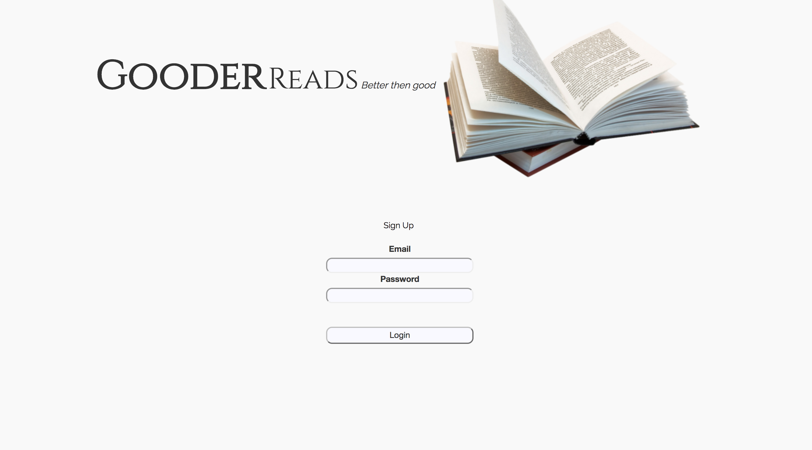

# Gooder Reads

My Gooder Reads project is a book review website designed to allow avid readers review books and comment on the reviews that other people have made.

My live, [Gooder Reads](https://gooder-reads.herokuapp.com/) site can be found here.

## Features
- Users are able to add books to their collection of read books and input the details of it.
- Users are able to write reviews on the books they have read.
Users are able to write reviews and comment on the books other people have listed as having read.
- profile page which displays the books you have read.

## Features to come
- Currently, users must manually find the book they want to review, from a list and comment on that book. If they do not check to see if their book is included in this list, they are able to input all details regarding the book. If a user does not check the book list there is the risk of having a double entry for the same book. To remedy this, I hope to include a search function so that a user can search for the title they wish to review and not have a double.

## Bugs
- Certain CSS properties are not displaying properly
